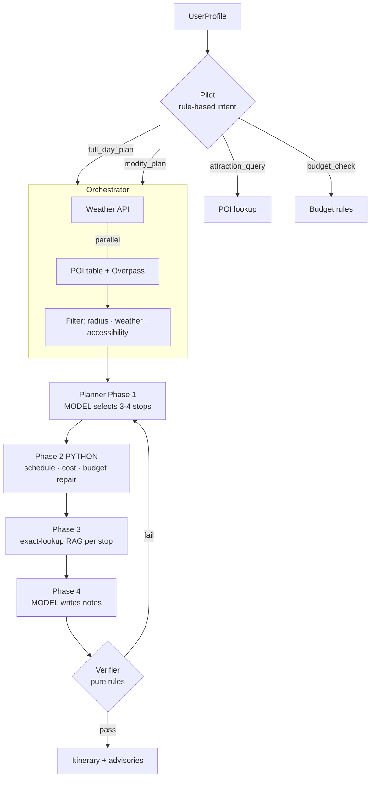

```
████████╗██████╗  █████╗ ██╗   ██╗███████╗██╗
╚══██╔══╝██╔══██╗██╔══██╗██║   ██║██╔════╝██║
   ██║   ██████╔╝███████║██║   ██║█████╗  ██║
   ██║   ██╔══██╗██╔══██║╚██╗ ██╔╝██╔══╝  ██║
   ██║   ██║  ██║██║  ██║ ╚████╔╝ ███████╗███████╗
   ╚═╝   ╚═╝  ╚═╝╚═╝  ╚═╝  ╚═══╝  ╚══════╝╚══════╝
 █████╗  ██████╗ ███████╗███╗   ██╗████████╗
██╔══██╗██╔════╝ ██╔════╝████╗  ██║╚══██╔══╝
███████║██║  ███╗█████╗  ██╔██╗ ██║   ██║
██╔══██║██║   ██║██╔══╝  ██║╚██╗██║   ██║
██║  ██║╚██████╔╝███████╗██║ ╚████║   ██║
╚═╝  ╚═╝ ╚═════╝ ╚══════╝╚═╝  ╚═══╝   ╚═╝
```

[](https://github.com/ys3197/Travel-Agent/actions/workflows/tests.yml)
[](https://www.python.org/)
[](https://huggingface.co/Qwen/Qwen2.5-3B-Instruct-AWQ)
[](https://github.com/vllm-project/vllm)
[](LICENSE)

A multi-agent day-trip planner for Rochester and the Finger Lakes, built around one
guiding constraint: **the language model chooses, Python computes.**

It runs on a **3B model served locally by vLLM** — no frontier model in the request path.
Everything with a verifiable right answer (schedule arithmetic, cost totals, budget
repair, hard constraints) is done in Python; the model is only asked to do the two things
it is actually good at — picking which attractions suit a person, and writing a sentence
about each one.

```
UserProfile ─▶ Pilot (rule-based intent) ─▶ agent path ─▶ Verifier ─▶ itinerary
```

---

[Why](#why-it-is-built-this-way) · [Architecture](#architecture) · [Retrieval](#retrieval-exact-lookup-vs-semantic-search) · [Attraction table](#the-attraction-table) · [Evaluation](#evaluation) · [Setup](#setup) · [Layout](#layout) · [Data](#data-provenance)

---

## Why it is built this way

A 3B model cannot be trusted to add up times and prices. Rather than prompt harder, the
pipeline narrows the model's job until it is small enough to be reliable:

| Step | Who does it | Why |
|---|---|---|
| Intent routing | **Rules** (keyword table) | Four intents, unambiguous keywords — an LLM call here buys nothing |
| Attraction selection | **Model** (constrained tool call) | Genuine judgement: does this fit *this* person? |
| Name validation | **Python** | Returned names are checked against the candidate list; the model cannot invent a POI |
| Schedule & cost | **Python** | Arithmetic has one right answer |
| Budget repair | **Python** | Costs are already known exactly — no need to re-plan |
| Per-stop notes | **Model** | Prose, grounded in retrieved material |
| Final validation | **Rules** | Time feasibility, budget, accessibility |

The same principle shows up in the RAG layer: when the agent already holds an exact
entity name, retrieval is an **exact metadata lookup**, not a vector search
([details below](#retrieval-exact-lookup-vs-semantic-search)).

---

## Architecture



**Components**

| Path | Role |
|---|---|
| `pipeline.py` | Pilot routing, retry loop, SLA deadline |
| `agents/orchestrator.py` | Parallel tool fetch, candidate filtering, schedule builder, deterministic budget repair |
| `agents/planner.py` | Two model calls: constrained selection, then annotation |
| `agents/verifier.py` | Pure-rule guardrails — time, budget, accessibility |
| `agents/tools/` | Weather, POI (curated table + OpenStreetMap Overpass), budget, images |
| `rag/` | Crawlers, Chroma ingest, retriever (semantic **and** exact-lookup) |
| `evals/` | Two-tier evaluation — see [Evaluation](#evaluation) |

---

## Retrieval: exact lookup vs semantic search

The corpus is **entity-organised** — every crawled record is about one attraction, and the
record title *is* the attraction name. So the retriever exposes two different primitives:

```python
retriever.retrieve(user_query, top_k=5)     # semantic — free-form user intent
retriever.retrieve_by_poi("Letchworth State Park")   # exact — the name is already known
```

`retrieve_by_poi` filters on the `title` metadata field and returns chunk 0 (the lead
paragraph). It never runs the embedding model, and it **returns nothing when there is no
material** — which is the point.

Measured over the 32-attraction pool, the previous vector-search-by-name approach pulled
material about the **wrong entity for 6 of them (19%)**:

| Query | What vector search actually returned |
|---|---|
| `ARTISANworks` | Central Rock Gym Rochester |
| `Dave & Buster's` | Central Rock Gym Rochester |
| `Ontario Beach Park` | *Rochester, New York* (the 126-chunk city overview) |
| `Canandaigua Lake` | Keuka Lake |
| `High Falls Rochester` | *Rochester, New York* — no entry exists for it at all |

Because the annotation prompt instructs the model to ground its notes in the retrieved
snippet, those five cases were a hallucination pipeline: the model was *told* to describe
ARTISANworks using a rock gym's blurb. Stops with no material are now explicitly marked
`[无参考资料]` and the prompt tells the model to write only generic advice for them.

---

## The attraction table

`agents/tools/poi_table.json` is the single source of truth — 43 rows, 32 enabled. The
skeleton is generated from the crawled corpus; the attribute fields are hand-verified.

```jsonc
{
  "name": "Letchworth State Park",
  "category": "nature",
  "cost_type": "state_park",
  "lat": 42.5706, "lon": -78.0517, "distance_km": 65,

  "indoor": false,                    // hand-verified — drives the bad-weather filter
  "kid_friendly": true,
  "wheelchair_accessible": null,      // null = UNKNOWN, semantically ≠ false
  "typical_visit_min": 150,
  "enabled": true, "curated": true
}
```

Two decisions worth calling out:

**`null` means unknown, not false.** The crawled corpus contains no real accessibility
information — every occurrence of "accessible" in it means something else ("accessible to
all climbers", "publicly accessible and not privately owned", "natural gas is now
accessible for extraction"). Treating unknown as inaccessible would empty the candidate
pool; treating it as accessible would be a lie. So unknown stops are kept, and the user is
told to call ahead.

**`indoor` is a verified field, not inferred from `category`.** The filter used to drop
`category == "outdoor"` in bad weather, which let through all ten of the genuinely
open-air attractions (Letchworth, Watkins Glen, Taughannock Falls, the open-air market,
an outdoor amphitheatre…) because their category is `nature`, while wrongly excluding an
*indoor* trampoline park. The pool on a rainy day went from 24/32 to a correct 15/32.

Rebuild the skeleton after adding crawler output:

```bash
python -m rag.build_poi_table     # incremental; never overwrites hand-edited fields
```

---

## Evaluation

Two tiers, deliberately separated by cost:

**Tier 1 — structural checks.** Pure assertions. No vLLM, no API key, ~1 s.

```
stop_count · within_budget · within_radius · note_length · accessibility · schedule_monotonic
```

These used to be bundled into a single LLM-judge score alongside subjective criteria. They
were split out for two reasons: a deterministic check is both cheaper and more accurate
than a judge for something like "is the total under budget", and a blended score cannot
tell you *which* of six things broke. They run **before** the judge, so a structurally
broken itinerary never costs judge tokens.

**Tier 2 — LLM judge.** Only what needs judgement: does the selection fit the person's
interests, does the "budget" style show up in the *choices* rather than just the total, is
the route sensibly ordered, are the notes specific rather than filler. The judge is
**Claude, deliberately not the Qwen model under test** — a model grading its own output
shares its blind spots.

```bash
pytest evals/ -q          # 28 pass; judge cases skip cleanly without vLLM / API key
```

---

## Setup

```bash
pip install -r requirements.txt
pip install -r requirements-dev.txt        # optional: LLM-judge evals

# 1. Serve the model
vllm serve Qwen/Qwen2.5-3B-Instruct-AWQ --port 8000 \
  --enable-auto-tool-choice --tool-call-parser hermes

# 2. Build the vector store from the crawled corpus (~1 min, CPU is fine)
python -m rag.ingest

# 3. Run one of the two front ends
streamlit run app.py                       # interactive UI
uvicorn server:app --port 8080             # HTTP API + static page
```

For the LLM-judge evals, put `ANTHROPIC_API_KEY` in `.env` (see `.env.example`).

---

## Layout

```
pipeline.py              Pilot routing + retry loop
server.py / app.py       FastAPI and Streamlit front ends
user_profile.py          Profile model; derives activity radius from transport mode
agents/
  orchestrator.py        Parallel fetch, filtering, scheduling, budget repair
  planner.py             Constrained selection + annotation
  verifier.py            Rule-based guardrails
  tools/
    poi.py               Candidate pool (table + Overpass)
    poi_table.json       Single source of truth — 43 rows
    weather.py budget.py images.py
rag/
  crawlers/              Wikipedia · VisitRochester · TripAdvisor · Mafengwo
  ingest.py              Chunk → embed → Chroma (494 vectors / 45 documents)
  retriever.py           Semantic search (MMR) + exact entity lookup
  poi_names.py           Deterministic name normalisation, shared offline and at runtime
  build_poi_table.py     Corpus → POI table skeleton (geocoding via Nominatim)
evals/
  structural_checks.py   Deterministic checks
  metrics.py             LLM-judge metrics (Claude)
  golden_cases.py        8 hand-written scenarios
scripts/
  smoke_test.py          Manual end-to-end run against a live vLLM server
```

---

## Data provenance

`rag/data/raw/*.jsonl` is cached crawler output, kept in-tree so the pipeline is
reproducible without re-crawling. Wikipedia content is CC BY-SA; VisitRochester listings
are cached factual entries (name, address, description) retained for evaluation
reproducibility, not redistribution. Re-run the crawlers in `rag/crawlers/` to regenerate.

The generated Chroma store (`rag/data/db/`) is **not** committed — rebuild it with
`python -m rag.ingest`.

---

## License

MIT — see [LICENSE](LICENSE).
